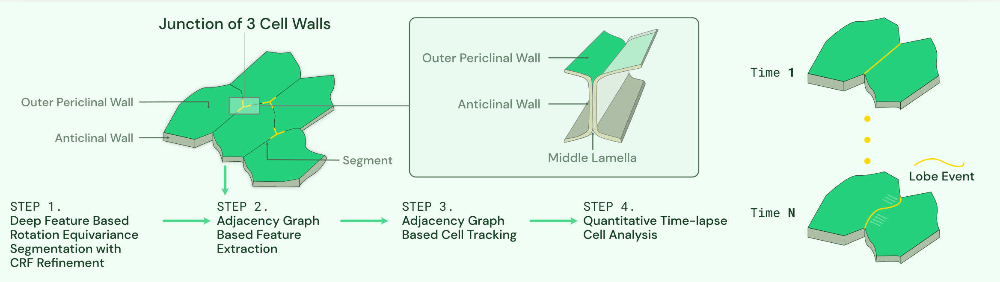

# Time-lapse 3D Cell Analysis
This repository contains the source code for the paper "Deep Learning Enabled Time-Lapse 3D Cell Analysis", where we introduce an end-to-end analysis method for boundary tagged 3D cell images.

